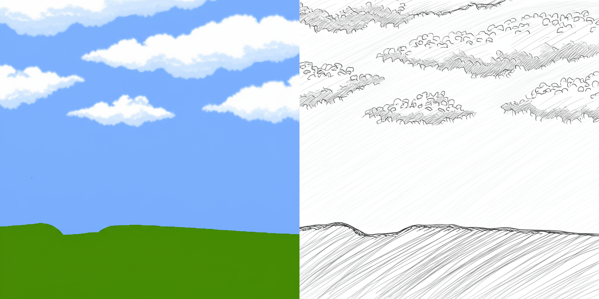

# KritaFlash - Gemini Image Generation Plugin

## Introduction
KritaFlash is a powerful plugin for Krita that leverages Google's Gemini AI to transform your artwork with intelligent image generation. With just a text prompt, you can apply creative transformations to your existing artwork.

### Example Transformation
**Original artwork → Transformed with prompt "Convert to pencil sketch style"**

---

## Installation
1. Download the KritaFlash plugin package.
2. Enable the plugin by navigating to:
   - `Settings` → `Python Plugin Manager` → `KritaFlash`
3. Restart Krita.
4. Ensure that the KritaFlash docker is enabled.

---

## Setting Up Your API Key
KritaFlash requires a Google Gemini API key to function. You need to obtain this key from Google AI Studio.

### Getting a Gemini API Key
1. Visit [Google AI Studio](https://aistudio.google.com/app/apikey).
2. Sign in with your Google account.
3. Click on "Create API Key".
4. Copy the generated API key.

**Important:** Keep your API key private. Do not share it or include it in publicly accessible code.

### Configuring the API Key in KritaFlash
1. Open Krita and navigate to the KritaFlash docker.
2. Click the "Configure API Key" button.
3. Paste your Gemini API key.
4. Click "Save".

### Alternative Configuration Methods
You can also set up your API key as an environment variable named `GEMINI_API_KEY`.

| Operating System | Command |
|------------------|---------|
| Windows | `setx GEMINI_API_KEY "your_api_key_here"` (Command Prompt) |
| macOS/Linux | Add `export GEMINI_API_KEY="your_api_key_here"` to `.bashrc` or `.zshrc` |

---

## Using KritaFlash

### Basic Usage
1. Open or create an image in Krita.
2. Ensure the KritaFlash docker is visible:
   - `Settings` → `Dockers` → `KritaFlash`
3. Enter a prompt, e.g., *"convert to oil painting style"*.
4. Click "Generate Image".
5. The generated image will be added as a new layer.

### Prompt Tips
**Effective Prompts:** Be specific! Instead of *"make it better"*, try *"enhance contrast and add purple lighting from the top right"*.

| Example Prompt | Description |
|---------------|-------------|
| "Convert to watercolor style" | Simulates watercolor painting |
| "Add dramatic lighting from the left" | Enhances lighting effects |
| "Make it look like a cyberpunk scene" | Applies cyberpunk aesthetic |
| "Add a foggy forest background" | Creates an atmospheric effect |

---

## Example Transformations

| Prompt | Result |
|--------|--------|
| "Convert to pencil sketch style" |  |
| "Add dramatic sunset lighting" |  |
| "Transform into anime style" |  |

---

## Troubleshooting

### Common Issues

| Problem | Solution |
|---------|---------|
| "API key not configured" error | Enter a valid Gemini API key in settings. |
| Generation fails or times out | Check internet connection, verify API key, simplify prompt, or try a smaller image size. |
| Generated image doesn’t appear | Ensure Krita has permissions to create layers. |
| KritaFlash docker missing | Enable it under `Settings` → `Dockers` → `KritaFlash`. |

### API Usage Limitations
Google Gemini API has usage limits based on your account tier. Check the [Google AI Pricing](https://ai.google.dev/pricing) page for details.

---

## License
This project is licensed under the MIT License. See [LICENSE](LICENSE) for details.

## Contributing
We welcome contributions! Please submit issues and pull requests via our [GitHub Repository](https://github.com/OVAWARE/Krita-Flash).

## Contact
For support or questions, open an issue on GitHub.

**KritaFlash v1.0 | [GitHub Repository](https://github.com/OVAWARE/Krita-Flash)**
